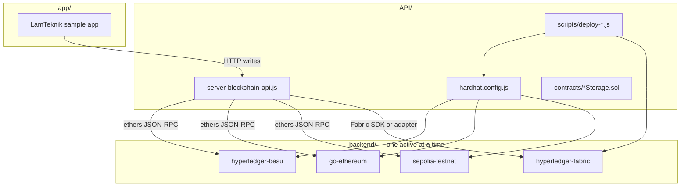
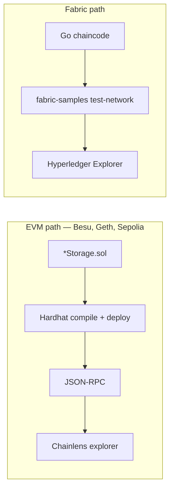

# Architecture Context

## Stack

| Layer | Technology | Role |
|-------|-----------|------|
| Sample app | LamTeknik (NestJS + MySQL when ported) | Generates data writes under test |
| Blockchain API | Node.js + Express + ethers | REST gateway to active chain; auto-generated entity routes |
| Contract tooling | Hardhat + Solidity 0.8.x | Compile and deploy EVM contracts |
| Fabric tooling | Go chaincode + Fabric test-network | Deploy and invoke on Fabric |
| Private chains | Docker Compose | Besu, Geth, Fabric node stacks |
| Public chain | Remote JSON-RPC (Sepolia) | No local node; env-only config |
| Block explorers | Chainlens (EVM), Hyperledger Explorer (Fabric) | Per-backend monitoring, bundled in compose |
| Reference | `repo/lamteknik-blockchain/` | Gitignored blueprint; not canonical source |

## System Boundaries

| Folder | Owns | Does not own |
|--------|------|-------------|
| `app/` | Sample application under test; env-driven API URL | Blockchain node config, contract deployment |
| `API/` | Express server, Hardhat config, Solidity contracts, deploy scripts, API command docs | Running blockchain nodes |
| `backend/<chain>/` | Docker compose, genesis/network config, node keys, chain-specific command docs | Application business logic |
| `backend/<chain>/command/` | Run/reset guides and ops scripts for that chain | Cross-chain API logic |
| `backend/<chain>/docker/` | Compose files, explorer config for that chain | Shared monitoring across chains |
| `repo/` | Reference implementation (read-only pattern source) | Canonical project code |
| `context/` | Project specs, architecture, progress | Runtime configuration |

## System Diagram



## EVM vs Fabric Deployment



EVM backends share Solidity contracts and Hardhat. Fabric uses equivalent Go chaincode implementing the same data envelope fields — not the same bytecode.

## Operating Model: Alternating Backends

**Only one blockchain backend runs at a time.** Stop the active stack before starting another.

Each backend has a **fixed, distinct port map** so switching targets is an env change only — no compose edits, no Besu reconfiguration.

The API selects the active target via `BLOCKCHAIN_TARGET=besu|geth|fabric|sepolia`.

## Port Allocation

| Backend | Primary RPC / access | Node / other ports | Explorer UI | Rule |
|---------|---------------------|-------------------|-------------|------|
| **Besu** | `:8545` (Node-1) | `:8546`–`:8548` (nodes 2–4) | `:8081` Chainlens | **Do not change** — `backend/hyperledger-besu/docker/docker-compose.yml` is canonical |
| **Geth** | `:8555` (primary RPC) | `:8556`–`:8558` (optional multi-node) | `:8082` Chainlens | Must not use 8545–8548 or 8081 |
| **Fabric** | Org1 peer `:7051`, Org2 `:9051` | orderer `:7050`; CouchDB `:5984` if enabled | `:8090` Hyperledger Explorer | Standard test-network defaults |
| **Sepolia** | Remote RPC URL | No local ports | Public Etherscan | Deferred; env-only |

### API / Hardhat env switching

```bash
# Besu
BLOCKCHAIN_TARGET=besu
BLOCKCHAIN_RPC_URL=http://localhost:8545
CHAIN_ID=1337

# Geth
BLOCKCHAIN_TARGET=geth
BLOCKCHAIN_RPC_URL=http://localhost:8555
CHAIN_ID=<geth-chain-id>

# Fabric
BLOCKCHAIN_TARGET=fabric
# Fabric SDK / peer env vars — see backend/hyperledger-fabric/command/

# Sepolia (deferred)
BLOCKCHAIN_TARGET=sepolia
BLOCKCHAIN_RPC_URL=https://sepolia.infura.io/v3/<key>
CHAIN_ID=11155111
```

Document these in each backend's `command/run-<chain>.md`.

## Monitoring / Block Explorers

Each blockchain service has **its own monitoring stack** — not a shared Chainlens instance. Explorers start and stop with their backend's compose.

| Backend | Tool | Port | Notes |
|---------|------|------|-------|
| Besu | Chainlens (Epirus) | `:8081` | Already bundled; do not modify |
| Geth | Chainlens (Epirus) | `:8082` | Own MongoDB volume; `NODE_ENDPOINT` → Geth `:8555` |
| Fabric | Hyperledger Explorer | `:8090` | Chainlens is EVM-only; cannot monitor Fabric |
| Sepolia | Etherscan (public) | — | No local explorer |

Rules:

1. One monitoring stack per backend — bundled in that backend's `docker-compose.yml`.
2. Do not modify Besu's Chainlens — Geth gets its own Epirus copy.
3. Separate MongoDB volumes per Chainlens — never share ingestion DB between Besu and Geth.
4. Document explorer URLs in each `command/run-<chain>.md`.

## Storage Model

### On-chain (all platforms)

`{x}Storage` contracts (EVM) or equivalent chaincode (Fabric) store:

- `recordId`, `createdTimestamp`, `modifiedTimestamp`, `modifiedBy`, `allData`
- Mappings, ID arrays, existence flags
- `{x}Stored` / `{x}Updated` events

### Off-chain

- Sample app database (MySQL when LamTeknik is ported) — unchanged by blockchain layer.
- Deploy artifacts: `API/build/<target>/` (ABI + addresses per chain).
- Benchmark results *(deferred)*: local JSON/CSV under `app/benchmarks/` or similar.

### Explorer indexing

- Chainlens MongoDB per EVM backend — chain-specific, not shared.
- Fabric Explorer DB — separate from Chainlens.

## Auth and Access Model

Local development only:

- Pre-funded deployer key from Besu genesis in `API/.env` (development keys — never use in production).
- Default Besu deployer: address `0xfe3b557e8fb62b89f4916b721be55ceb828dbd73`, key in genesis alloc (see reference `API/.env.example`).
- Fabric uses MSP certs generated by test-network — document paths in command docs, do not commit secrets.
- Sepolia *(deferred)*: faucet-funded wallet + RPC provider API key.

No production auth, RBAC, or credential management in current scope.

## Development Environment

Primary dev OS: **Windows 10**. Cross-platform rules:

- Prefer **Docker Compose** over native CLI for node startup.
- Shell scripts (`.sh`) may require **Git Bash or WSL** on Windows.
- Fabric `network.sh` requires **WSL or Git Bash** on Windows.
- Besu manual run guide (`command/run-besu-ibft.md`) references Mac CLI — Docker Compose is the canonical cross-platform path.

## Invariants

1. **Alternating operation** — only one blockchain backend runs at a time.
2. **One active target per API instance** — selected via `BLOCKCHAIN_TARGET` env.
3. **Besu ports immutable** — 8545–8548 and 8081 must never change.
4. **Distinct ports per backend** — Geth uses 8555+/8082; Fabric uses 7050/7051/9051/8090.
5. **EVM chains share Solidity + Hardhat** — Fabric uses Go chaincode with the same envelope fields.
6. **REST route shape stable across EVM backends** — Fabric may use an internal adapter; comparison is on store latency, not identical HTTP paths.
7. **`repo/` is reference-only** — port patterns into root folders; do not edit reference in place.
8. **Performance tests use identical payload and batch count** per backend run *(when benchmarks are implemented)*.
9. **One monitoring stack per backend** — never share Chainlens MongoDB between chains.

## Backend Setup Notes

| Backend | Setup approach |
|---------|---------------|
| **Besu** | Done: IBFT genesis chain ID 1337, 4 nodes, Docker Compose + Chainlens on 8081 |
| **Geth** | Done (config): Docker `ethereum/client-go:stable` in `--dev` mode (single node, Geth v1.14+); RPC on 8555, Chainlens on 8082; multi-node via Kurtosis PoS deferred |
| **Fabric** | `fabric-samples/test-network`: `network.sh up createChannel -ca`, `deployCC`; chaincode mirrors envelope fields; Explorer on 8090 |
| **Sepolia** | No Docker node; `.env` with public RPC URL, chain ID 11155111, funded test wallet; Hardhat `sepolia` network entry |

Use Context7 MCP (`/ethereum/go-ethereum`, `/hyperledger/fabric`) for latest setup docs when implementing Geth and Fabric.
