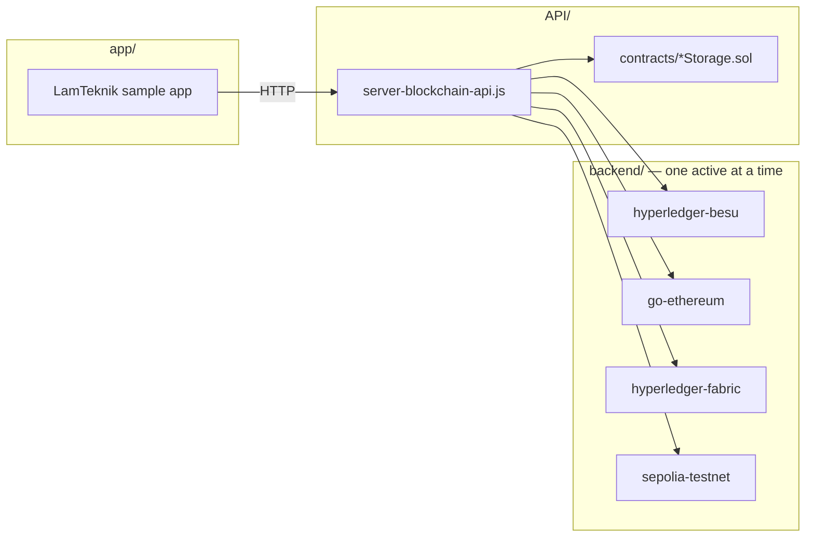

# Blockchain Compare — Project Overview

## Purpose

This project compares **how different blockchain platforms handle data transactions** when driven by the same sample application workflow. The goal is to run identical write workloads against multiple backends and observe differences in transaction handling, latency, and operational setup.

Targets under comparison:

| Platform | Type | Backend folder |
|----------|------|----------------|
| Hyperledger Besu | Private EVM (IBFT) | `backend/hyperledger-besu/` |
| Go Ethereum (Geth) | Private EVM | `backend/go-ethereum/` |
| Hyperledger Fabric | Permissioned ledger (chaincode) | `backend/hyperledger-fabric/` |
| Sepolia testnet | Public EVM | `backend/sepolia-testnet/` |

The sample application lives in `app/`. The blockchain interaction layer lives in `API/`. Each platform's node stack lives under `backend/<chain>/`.

## Goals

1. Run the **LamTeknik** sample app (current test case) against each backend with minimal rework.
2. Keep a **universal `{x}Storage` contract pattern** so future apps can swap in without restructuring folders.
3. Capture **measurable latency/throughput benchmarks** for the same logical record payload across platforms (deferred until backends are stable).
4. Document **repeatable commands** in each backend's `command/` folder so any developer or AI agent can start a stack end to end.

## Core Flow

1. Start one blockchain backend (`docker compose up` in `backend/<chain>/docker/`).
2. Deploy smart contracts (EVM) or chaincode (Fabric) via `API/scripts/deploy-<chain>.js`.
3. Start the blockchain API (`API/server-blockchain-api.js`).
4. Run the sample app in `app/` — writes go through the API to the active chain.
5. Monitor blocks and transactions via that backend's own explorer (Chainlens or Hyperledger Explorer).
6. *(Later)* Collect timing metrics for comparison.

## Architecture at a Glance

See [`architecture.md`](architecture.md) for port maps, monitoring setup, and invariants.

## Universal Data Envelope

Every `{x}Storage` smart contract stores the same record shape (defined in `backend/hyperledger-besu/note.txt`):

| Field | Type | Purpose |
|-------|------|---------|
| `recordId` | string | Unique record identifier |
| `createdTimestamp` | uint | Creation time |
| `modifiedTimestamp` | uint | Last modification time |
| `modifiedBy` | string | Actor who last modified |
| `allData` | string | JSON payload |

Functions: `store{x}()` emits `{x}Stored` (new) or `{x}Updated` (existing).

This pattern comes from LamTeknik's 26 entity contracts but generalizes to any entity name `x`. Smart contracts adapt to sample app needs — not the reverse.

## Features

### In scope

- Multi-chain REST API with Hardhat deploy pipeline (`API/`)
- Per-chain Docker backends with `command/` runbooks (`backend/`)
- Per-backend block explorers (Chainlens for EVM, Hyperledger Explorer for Fabric)
- LamTeknik as the first sample app (minimal subset initially)
- Local development on Windows, macOS, and Linux
- AI-agent-friendly context files and repeatable workflows

### Out of scope (current phase)

- Production HA, monitoring, or credential management
- Mainnet deployment
- Full CDC pipeline (MySQL → Kafka → Debezium) — lives in reference repo only unless explicitly ported
- IPFS integration
- Running multiple blockchain backends simultaneously

## Phase Plan

| Phase | Focus | Status |
|-------|-------|--------|
| **0** | Context files + folder scaffold | In progress |
| **1** | Geth + Fabric backends running (Docker + command docs) | Next |
| **2** | API layer ported from reference + Besu deploy working | Planned |
| **3** | Minimal LamTeknik sample in `app/` | Planned |
| **4** | Sepolia RPC config | Deferred |
| **5** | Performance benchmark harness | Deferred |

## Reference Material

[`repo/lamteknik-blockchain/`](../repo/lamteknik-blockchain/) is a **gitignored reference clone** containing a fully working LamTeknik + Besu + CDC stack. Use it as a pattern source — port code into root `API/` and `backend/`, do not edit reference in place.

Key reference files:

- `repo/lamteknik-blockchain/API/server-lamteknik.js` — auto-generated REST routes
- `repo/lamteknik-blockchain/API/hardhat.config.js` — Hardhat network config
- `repo/lamteknik-blockchain/run-all.md` — full-stack startup guide

New clones will not have `repo/` — obtain it manually and place it at `repo/lamteknik-blockchain/`.

## Success Criteria

1. Each backend starts via documented commands and accepts at least one write.
2. Documented `command/run-<chain>.md` exists for Besu, Geth, and Fabric.
3. API `/health` reports connectivity to the active backend.
4. *(Deferred)* Comparable timing numbers captured for at least one entity batch across platforms.

## Comparison Categories

When benchmarking (later), treat results as **category comparisons**, not a single leaderboard:

| Category | Backends | Notes |
|----------|----------|-------|
| Private EVM | Besu, Geth | Same Solidity contracts; compare IBFT vs Clique/PoA |
| Permissioned non-EVM | Fabric | Endorse → order → commit lifecycle; chaincode not bytecode |
| Public EVM | Sepolia | Variable network latency and gas; reference only |
